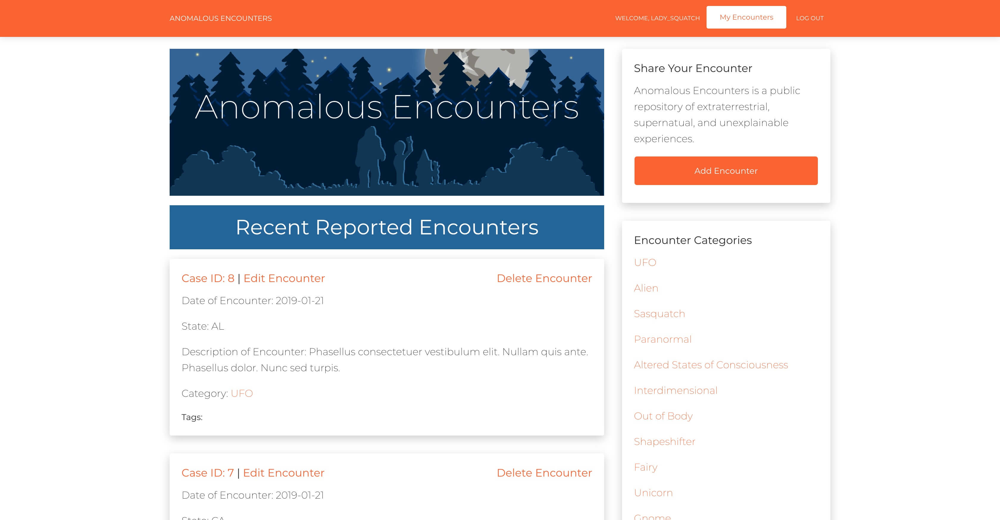
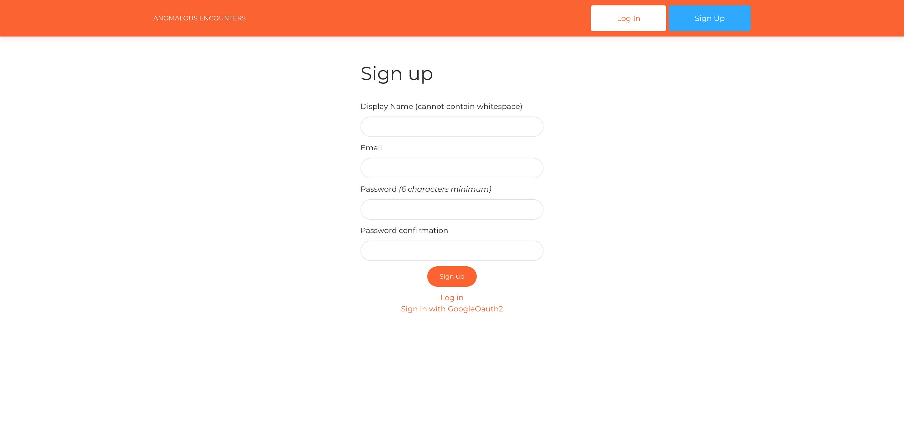
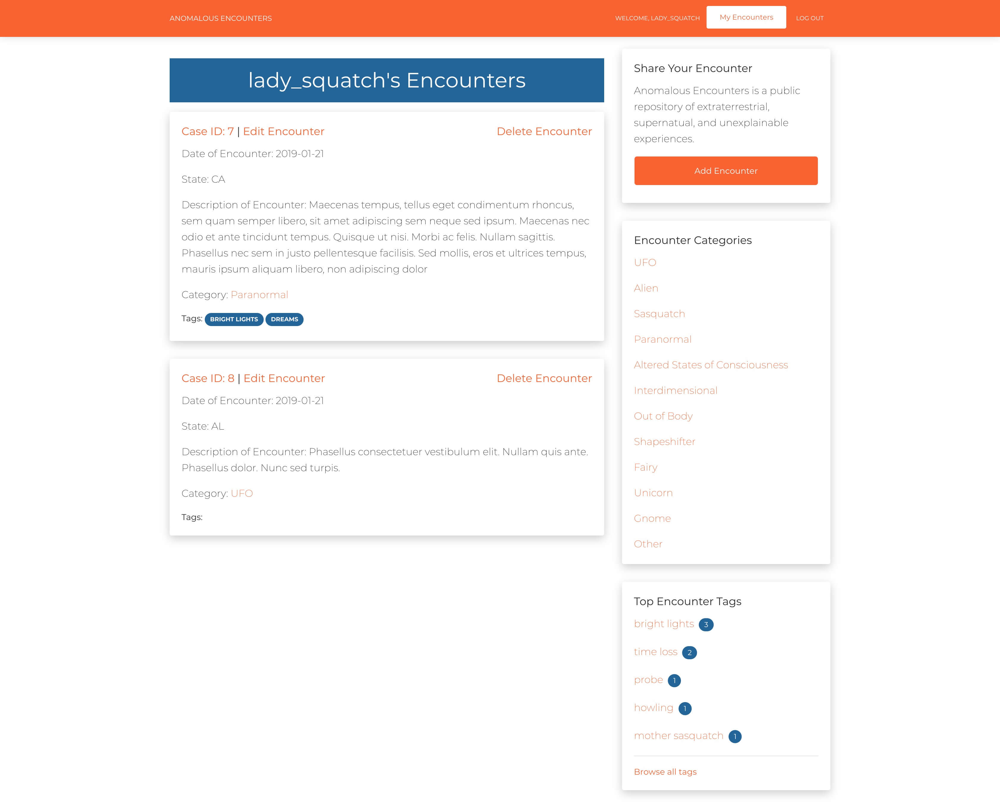
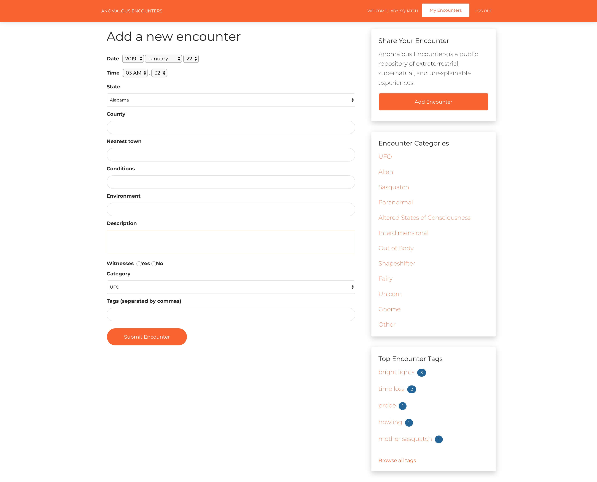

# Anomalous Encounters

**A public repository of extraterrestrial, supernatual, and unexplainable experiences.**

Built with Rails, Anomalous Encounters is a public Content Management System that allows users to record, tag, and share individual encounters

## Installation/Development
Fork and clone this repo, then run:
```
bundle install
rake db:migrate

rake db:seed
```

To run your own local development server, run

```
rails s
```

## Screenshots
<div class="d-inline-block">
  
</div>
<div class="d-inline-block">
  
</div>
<div class="d-inline-block">
  
</div>
<div class="d-inline-block">
  
</div>


## License
Anomalous Encounters is released under the MIT license.
